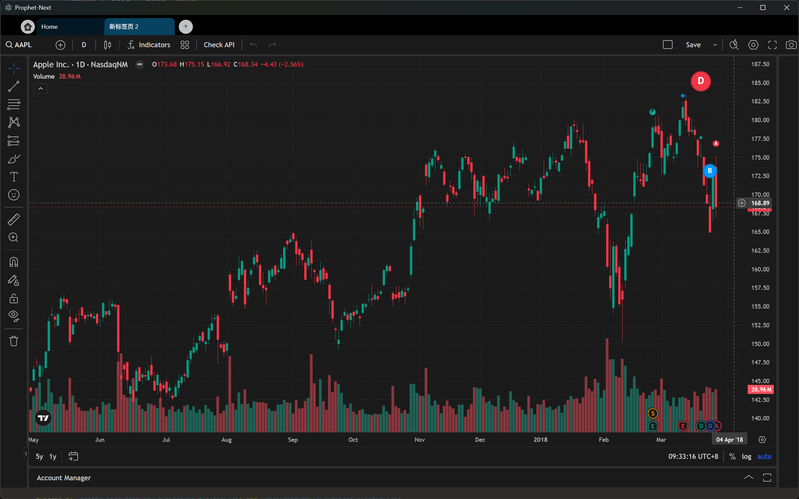

<div align=center></div>
</br>
<div align=center>Prophet-Next</div>
</br>
</br>
</br>
<div align=center></div>


## Develop Environment Setup
1. install with windows package control
    ```powershell
    # installs fnm (Fast Node Manager)
    winget install Schniz.fnm

    # close and restart a new windows shell
    fnm env --use-on-cd | Out-String | Invoke-Expression

    # download and install Node.js
    fnm use --install-if-missing 20

    # verifies the right Node.js version is in the environment
    node -v 

    # verifies the right NPM version is in the environment
    npm -v 

    # optinal: find all available version
    fnm list-remote

    # optinal: find all installed version
    fnm list

    # optinal: install a new version 
    fnm install v22.17.0

    # optinal: select a default version
    fnm default v22.17.0

    # optinal: install nrm to manager npm source
    npm install -g nrm
    # optinal: `nrm ls` to show all avaliable source, `nrm use` to set it
    ```
2. close and restart a new Windows shell, run `npm -v`, it should tell you that the npm is not a valied command or executable, that because the npm env is one-time-drop now. You can try `fnm env --use-on-cd | Out-String | Invoke-Expression` again, and then `npm -v`, and it should work again.

3. to make npm env activate auto start with windows shell, edit the `C:\Users\${username}\Documents\WindowsPowerShell\profile.ps1` which created when install anaconda, edit it as bellow:
    ```powershell
    #region conda initialize
    # !! Contents within this block are managed by 'conda init' !!
    If (Test-Path "C:\ProgramData\anaconda3\Scripts\conda.exe") {
        (& "C:\ProgramData\anaconda3\Scripts\conda.exe" "shell.powershell" "hook") | Out-String | ?{$_} | Invoke-Expression
    }
    #endregion

    #region npm initialize
    fnm env --use-on-cd | Out-String | Invoke-Expression
    #endregion
    ```
4. install vue
    ```shell
    npm i @vue/cli -g
    ```

## Recommended IDE Setup

- [VSCode](https://code.visualstudio.com/) + [ESLint](https://marketplace.visualstudio.com/items?itemName=dbaeumer.vscode-eslint) + [Prettier](https://marketplace.visualstudio.com/items?itemName=esbenp.prettier-vscode) + [Volar](https://marketplace.visualstudio.com/items?itemName=Vue.volar)

## Project Setup

### Install

```bash
$ npm install
```

### Development

```bash
$ npm run dev
```

### Build

```bash
# For windows
$ npm run build:win

# For macOS
$ npm run build:mac

# For Linux
$ npm run build:linux
```

## Referemce
1. [electron-vite](https://cn.electron-vite.org/)
2. [清理npm包](https://juejin.cn/post/6997956167473463327)
3. [element-plus 前端组件库](https://element-plus.org/zh-CN/component/overview.html)
4. [UDF API](./UDF-api.md)
5. [Electron + Vue + Vite + Python + FastAPI](https://github.com/hafiidz/electron-vite-vue-fastapi)
6. [TradingView API Reference](https://www.tradingview.com/charting-library-docs/latest/connecting_data/Datafeed-API#getservertime)
7. [Binance WSS API](https://developers.binance.com/docs/binance-spot-api-docs/web-socket-streams)
8. [CCXT: 跨交易所的交易API封装库，为各种交易所提供统一的上层接口，支持python和js](https://docs.ccxt.com/#/README?id=social)
9. [wondertreader](https://wtdocs.readthedocs.io/zh/latest/)
10. [install-redis-on-linux](https://redis.io/docs/latest/operate/oss_and_stack/install/install-redis/install-redis-on-linux/)